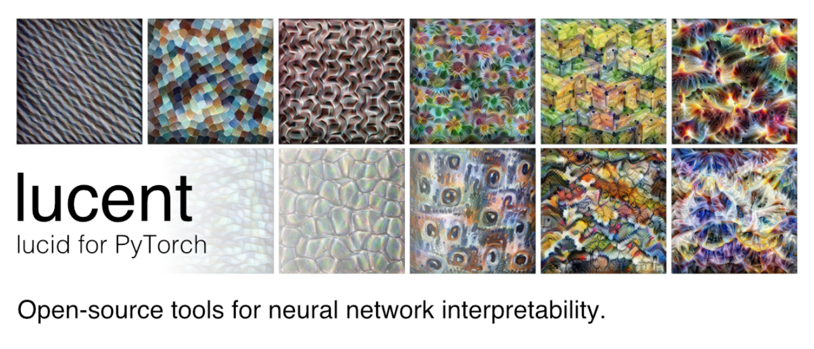

# Lucent

<!--*It's still magic even if you know how it's done. GNU Terry Pratchett*-->

[Lucid](https://github.com/tensorflow/lucid) library adapted for PyTorch.

To quote Lucid:

**Lucent is research code, not production code. We provide no guarantee it will work for your use case.**

# Usage

In the spirit of Lucid, get up and running with Lucent immediately! The following notebooks
run right from your browser, thanks to [Colaboratory](https://colab.research.google.com/notebooks/welcome.ipynb). It's a Jupyter notebook environment that requires no setup to use and runs entirely in the cloud.

You can run the notebooks on your local machine, too. Clone the repository and find them in the `notebooks` subfolder. You will need to run a local instance of the [Jupyter notebook environment](http://jupyter.org/install.html) to execute them.

## Tutorial

<a href="images/card_1_tutorial.jpg">
</img>
</a>

# Recomended Reading

* [Feature Visualization](https://distill.pub/2017/feature-visualization/)
* [The Building Blocks of Interpretability](https://distill.pub/2018/building-blocks/)
* [Using Artificial Intelligence to Augment Human Intelligence](https://distill.pub/2017/aia/)
* [Visualizing Representations: Deep Learning and Human Beings](http://colah.github.io/posts/2015-01-Visualizing-Representations/)
* [Differentiable Image Parameterizations](https://distill.pub/2018/differentiable-parameterizations/)
* [Activation Atlas](https://distill.pub/2019/activation-atlas/)

## Related Talks
* [Lessons from a year of Distill ML Research](https://www.youtube.com/watch?v=jlZsgUZaIyY) (Shan Carter, OpenVisConf)
* [Machine Learning for Visualization](https://www.youtube.com/watch?v=6n-kCYn0zxU) (Ian Johnson, OpenVisConf)

# Slack

Check out the Lucid community at `#proj-lucid` on the Distill slack ([join link](http://slack.distill.pub))!

# Additional Information

## License and Disclaimer

You may use this software under the Apache 2.0 License. See [LICENSE](LICENSE).
